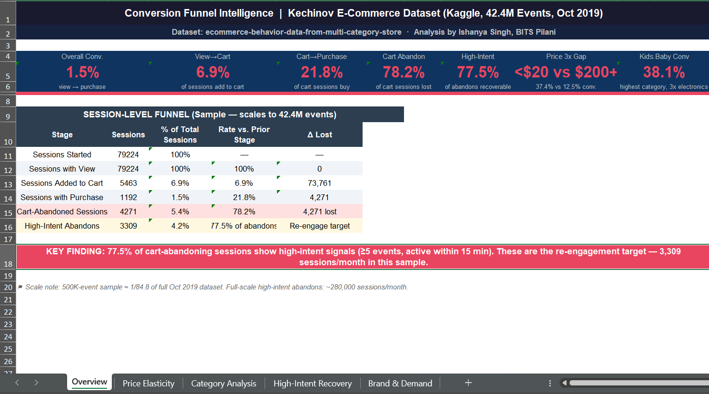

# Customer Funnel & Cart Recovery Analytics

## Overview
An end-to-end SQL analytics project that analyzes customer journeys, identifies funnel drop-offs, predicts purchase intent, and uncovers cart abandonment trends to improve conversion rates.

## Dashboard Preview



## Business Objectives
- Analyze customer conversion funnels
- Identify cart abandonment patterns
- Score customer purchase intent
- Measure key e-commerce KPIs
- Recommend recovery opportunities

## Tech Stack
- SQL (SQLite)
- Excel
- Git & GitHub

## SQL Concepts
- Joins
- CTEs
- Window Functions
- CASE Statements
- Aggregate Functions
- Subqueries

## Repository Structure

```
Customer-Funnel-Cart-Recovery/
│── sql/
│── dashboard/
│── documentation/
│── images/
└── README.md
```

## Dataset
This project is based on the **Kechinov E-Commerce Behavior Dataset (October 2019)** from Kaggle. Due to its large size, the full dataset is not included in this repository. Please download it directly from Kaggle before running the SQL analysis.

## Learning Outcomes
This project demonstrates practical SQL skills for customer behavior analysis, funnel optimization, marketing analytics, intent scoring, and business decision-making using a realistic e-commerce dataset.
